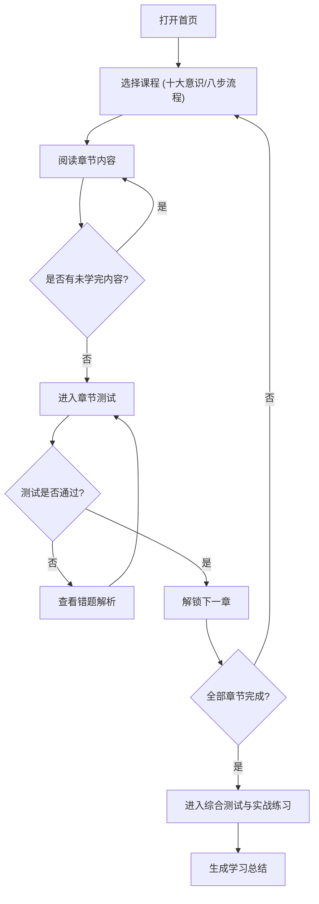

## 1. 产品概述

丰田工作方法（TBP）学习平台是一个H5移动端网页产品，核心价值在于帮助用户系统学习丰田工作方法（Toyota Business Process）。

* 主要目的：将TBP的十大基本意识和八步问题解决流程转化为结构化、可交互的学习内容，通过测验巩固理解，通过实战提升应用能力。

* 目标用户：企业管理者、基层员工、改善专员、学生/求职者等公开学习者。

## 2. 核心功能

### 2.1 用户角色

| 角色    | 注册方式     | 核心权限                    |
| ----- | -------- | ----------------------- |
| 普通学习者 | 手机号/微信登录 | 浏览学习模块、参与测试、生成总结、查看个人中心 |

### 2.2 功能模块

1. **首页**：课程入口（十大基本意识、八步问题解决流程）、学习进度、个人中心入口。
2. **学习模块**：图文混排呈现TBP核心内容（十大基本意识共10章，八步问题解决流程共8章），支持断点续学、进度记录。
3. **练习模块**：章节测试（选择题、判断题、简答题）、综合测试、实战练习（生产、质量、效率案例）。
4. **总结模块**：学习完后生成个人学习总结、测试成绩汇总。
5. **个人中心**：学习记录、我的笔记、测试成绩。

### 2.3 页面详情

| 页面名称 | 模块名称    | 功能描述                         |
| ---- | ------- | ---------------------------- |
| 首页   | 课程卡片    | 展示“十大基本意识”与“八步流程”的入口，显示整体进度条 |
| 学习页  | 章节内容    | 章节标题、目标、知识点、案例，支持上下滑动，记录进度   |
| 测试页  | 章节/综合测试 | 选择、判断题展示，支持提交并即时反馈成绩及错题解析    |
| 总结页  | 学习总结    | 展示学习时长、章节进度、成绩汇总，可复制文本       |
| 个人中心 | 个人数据    | 展示已学章节、累计时长，管理个人笔记，查看历史测试成绩  |

## 3. 核心流程

用户核心学习与练习流程：

## 4. 用户界面设计

### 4.1 设计风格

* **推荐调色板**：illustration（教育/创意风格），友好、圆润、温暖

* **主色**：#4A90D9（品牌色、按钮、强调）

* **辅色**：#5AC8FA（辅助元素、图标）

* **强调色**：#FF9500（重点提示、进度）

* **成功色**：#34C759（正确、已完成）

* **错误色**：#FF3B30（错误、提醒）

* **背景色**：#F5F5F7（页面背景）

* **文字主色**：#1D1D1F（正文标题）

* **文字辅色**：#86868B（辅助说明）

* **字体**：PingFang SC（标题20-28px粗体，正文14-16px常规，辅助12px常规，按钮14-16px中等）

* **圆角与间距**：页面边距16px，组件间距12px，卡片内边距16px，卡片圆角12px

### 4.2 页面设计概览

| 页面名称 | 模块名称  | UI元素                                         |
| ---- | ----- | -------------------------------------------- |
| 首页   | 顶部与主体 | Logo+标题，课程入口卡片列表（全宽、自适应高度、带轻微投影），底部Tab栏      |
| 学习页  | 内容展示区 | 顶部固定章节标题+进度条，中部图文混排区，底部下一章/测试入口按钮            |
| 测试页  | 答题区   | 顶部进度条+题号，主体选择题（单选/多选/Toggle），底部填充主色圆角8px提交按钮 |

### 4.3 响应式要求

* **设备适配**：移动端优先，H5网页（适配375px-428px宽度范围）

* **兼容性**：iOS 12+ / Android 8+ / Safari / Chrome / 微信内置浏览器

* **无障碍**：文字对比度≥4.5:1，点击区域≥44x44px

### 4.4 动效规范

* 按钮点击：缩放95% (150ms)

* 页面切换：淡入淡出 (250ms)

* 进度更新：平滑过渡 (300ms)

* 弹窗：放大出现 (200ms)

