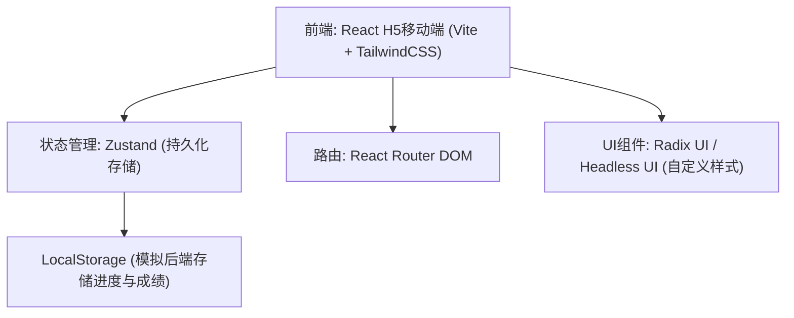
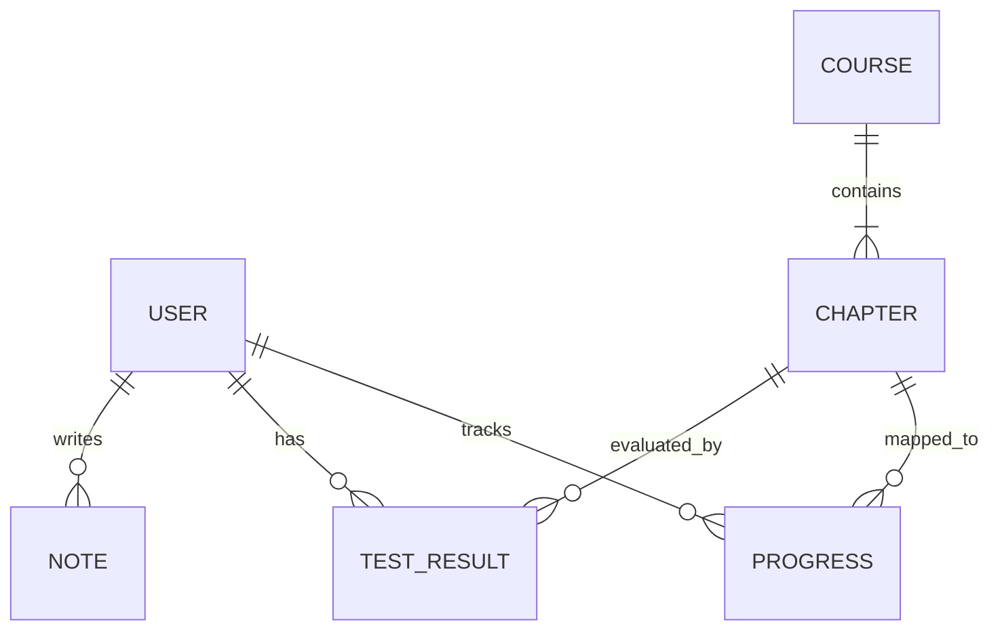

## 1. 架构设计


## 2. 技术说明
- **前端框架**: React@18
- **构建工具**: Vite
- **样式方案**: TailwindCSS@3
- **路由管理**: react-router-dom@6
- **状态管理**: zustand (配合 persist middleware 用于本地持久化存储进度、测试成绩和笔记)
- **图标库**: lucide-react 或 heroicons
- **动效库**: framer-motion (实现页面切换淡入淡出、进度更新等动效)
- **适配方案**: 移动端优先 (Mobile-First)，通过 Tailwind 的 `max-w-md mx-auto` 等类名适配 375px-428px 宽度范围，保证在 PC 浏览器上居中显示手机视图。

## 3. 路由定义
| 路由路径 | 用途 |
|----------|------|
| `/` | 首页 (展示课程入口、学习进度) |
| `/learning/:courseId/:chapterId` | 学习详情页 (展示特定章节内容) |
| `/practice/:courseId/:chapterId` | 章节测试页 (展示章节练习题) |
| `/comprehensive-test` | 综合测试页 |
| `/summary` | 学习总结页 |
| `/profile` | 个人中心 (学习记录、笔记、历史成绩) |

## 4. 数据模型 (Mock API / Zustand Store)
### 4.1 数据模型定义


### 4.2 TypeScript 类型定义
```typescript
interface User {
  id: string;
  name: string;
  createdAt: number;
}

interface Chapter {
  id: string;
  courseId: string; // 'awareness' | 'process'
  title: string;
  content: string; // Markdown or HTML
  order: number;
}

interface Progress {
  userId: string;
  chapterId: string;
  status: 'not_started' | 'in_progress' | 'completed';
  updatedAt: number;
}

interface TestResult {
  userId: string;
  chapterId: string; // 'comprehensive' for final test
  score: number;
  answers: Record<string, string | string[]>;
  submittedAt: number;
}

interface Note {
  id: string;
  userId: string;
  chapterId: string;
  content: string;
  createdAt: number;
}
```

## 5. 项目初始化流程
1. 使用 `npm create vite@latest . -- --template react-ts` 初始化项目。
2. 安装 TailwindCSS 及其依赖: `npm install -D tailwindcss postcss autoprefixer`。
3. 初始化 Tailwind 配置文件，并配置主题颜色和字体。
4. 安装相关依赖库: `npm install react-router-dom zustand framer-motion lucide-react`。
5. 搭建核心页面与组件骨架。
